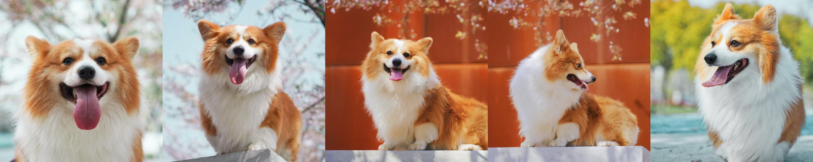
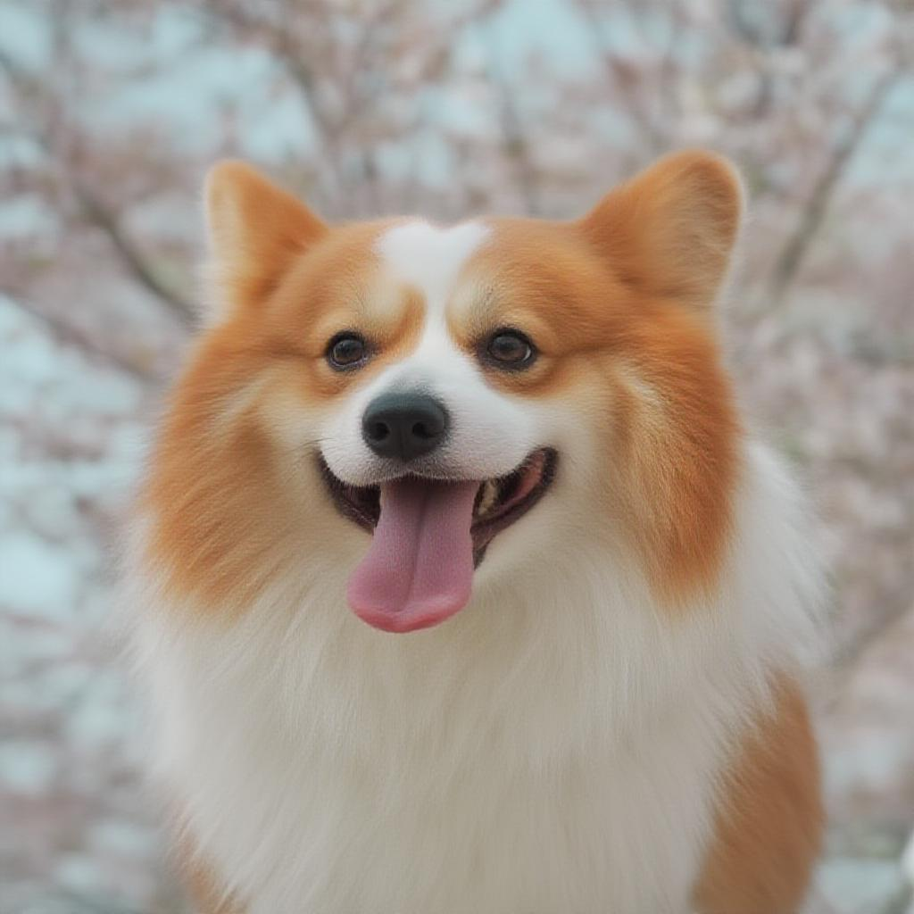
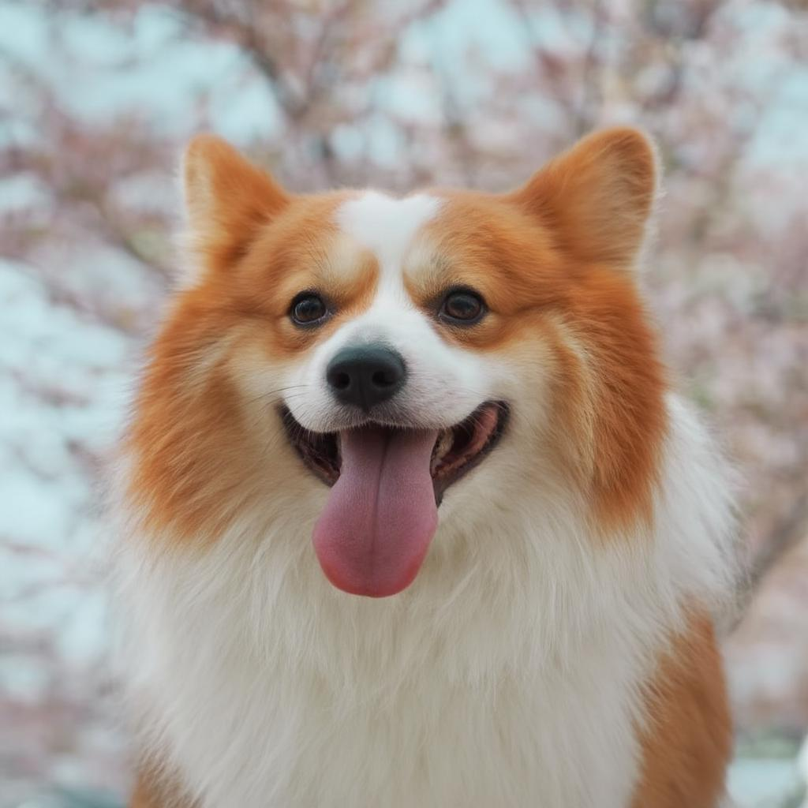
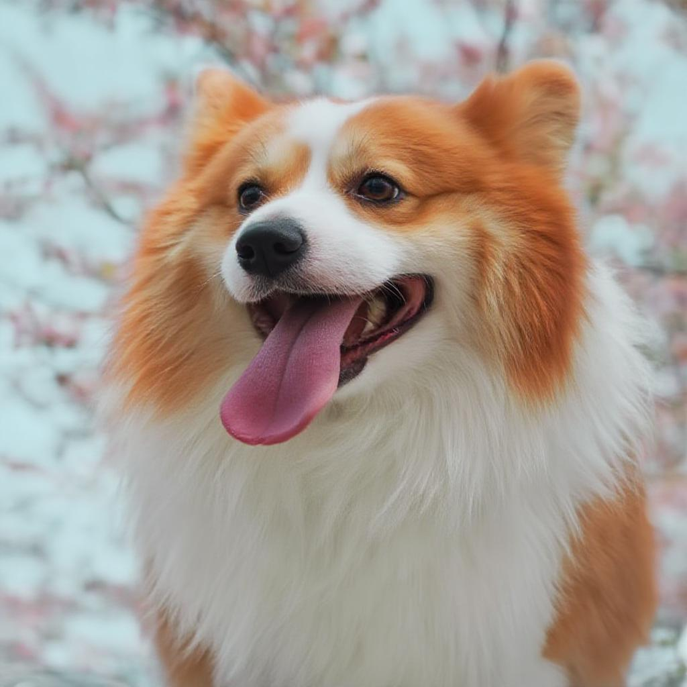

# Z-Image Turbo 加速能力修复 LoRA

## 模型介绍

这个模型是用于修复 Z-Image Turbo LoRA 加速能力的 LoRA。

直接基于 Z-Image Turbo 训练出的 LoRA 会失去加速能力，在加速配置（steps=8，cfg=1）下生成的图像变得模糊，在非加速配置（steps=30，cfg=2）下生成的图像正常。

更多关于训练策略和实现细节，欢迎查看我们的[技术博客](https://modelscope.cn/learn/3285)。

## 效果展示

训练数据：



生成结果：

|steps=8，cfg=1|steps=30，cfg=2|steps=8，cfg=1，使用本模型修复|
|-|-|-|
||||

## 推理代码

```python
from diffsynth.pipelines.z_image import ZImagePipeline, ModelConfig
import torch

pipe = ZImagePipeline.from_pretrained(
    torch_dtype=torch.bfloat16,
    device="cuda",
    model_configs=[
        ModelConfig(model_id="Tongyi-MAI/Z-Image-Turbo", origin_file_pattern="transformer/*.safetensors"),
        ModelConfig(model_id="Tongyi-MAI/Z-Image-Turbo", origin_file_pattern="text_encoder/*.safetensors"),
        ModelConfig(model_id="Tongyi-MAI/Z-Image-Turbo", origin_file_pattern="vae/diffusion_pytorch_model.safetensors"),
    ],
    tokenizer_config=ModelConfig(model_id="Tongyi-MAI/Z-Image-Turbo", origin_file_pattern="tokenizer/"),
)
pipe.load_lora(pipe.dit, "path/to/your/lora.safetensors")
pipe.load_lora(pipe.dit, ModelConfig(model_id="DiffSynth-Studio/Z-Image-Turbo-DistillPatch", origin_file_pattern="model.safetensors"))
image = pipe(prompt="a dog", seed=42, rand_device="cuda")
image.save("image.jpg")
```

